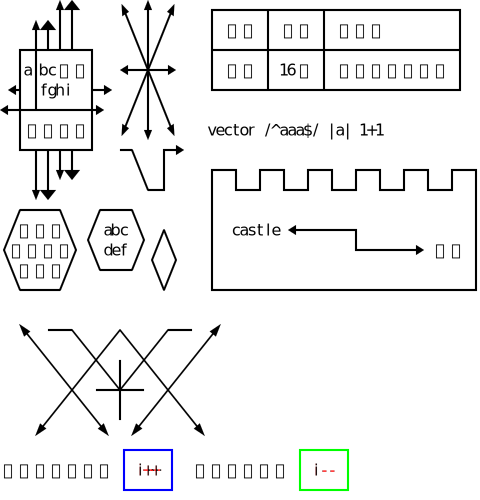

# Ascii Figure To Svg

アスキーアートで作図したテキストを、SVGファイルに変換します。

* version: 1.0.3
* Author: Masakazu Yanai
  * https://crocro.com/
  * https://twitter.com/ruten
* (c) 2020 Masakazu Yanai

[Demo : アスキーアートの図をSVGに変換](https://crocro.com/tools/item/ascii_figure_to_svg.html)

## 特徴

全角文字を考慮しており、半角英数字、全角日本語が混在したテキストから、SVGへの変換を行います。

この手のライブラリにありがちな、以下の問題点を解決しています。

* 日本語の全角幅が考慮されていない。
	* → 考慮しています。
* 日本語の全角文字の上に縦線を引くと、左寄りか右寄りになり、全角幅にならない。
	* → 全角幅の縦線や矢印に対応。

絵文字やサロゲートペアには対応していません。

第2引数に設定の一部を上書きするオブジェクトを書くことで、各種設定を変更して出力できます。

* 1マスの横幅や高さ。線の幅。
* 文字のサイズ、色、フォントの種類。
* 線の色。

## サンプル

元の文字列。

```
       ^＾     ^  ^  ^    +------+------+----------------+
    ^＾|｜      \ | /     | 名前 | 年齢 | 出身地         |
  +-+＋+＋-+     \|/      +------+------+----------------+
  |a|bcＤＥ|   <--+-->    | 太郎 | 16歳 | 福岡県北九州市 |
 <+ |fghi  +->   /|\      +------+------+----------------+
<-+-+------+>   / | \     
  |あいうえ|   v  v  v    vector /^aaa$/ |a| 1+1
  +-+＋+＋-+   -+   +->   
    |｜vｖ       \  |     +--+  +--+  +--+  +--+  +--+  +--+
    vｖ           +-+     |  +--+  +--+  +--+  +--+  +--+  |
  +----+    +---+         |                                |
 /あいう\  / abc \  +     |  castle <-------+              |
+えおかき+ \ def / / \    |                 +-------> お城 |
 \くけこ/   +---+  \ /    |                                |
  +----+            +     +--------------------------------+
  
  ＾  --＋    ＋    ＋--  ＾
    ＼    ＼／  ＼／    ／  
      ＼  ／＼｜／＼  ／    
        ＋  --＋--  ＋      
      ／  ＼  ｜  ／  ＼    
    ｖ      ｖ  ｖ      ｖ  
```

出力したSVG。



## 作図に使える文字

### 半角記号

* 「+」結節点。あるいは折れ位置。
* 「-」横線。
* 「|」縦線。
* 「<」左矢印の三角形の部分。
* 「>」右矢印の三角形の部分。
* 「^」上矢印の三角形の部分。
* 「v」下矢印の三角形の部分。
* 「/」左下から右上への斜め線。
* 「\」左上から右下への斜め線。

### 全角記号

* 「＋」全角幅の結節点。あるいは折れ位置。
* 「｜」全角幅の縦線。
* 「＾」全角幅の上矢印の三角形の部分。
* 「ｖ」全角幅の下矢印の三角形の部分。
* 「／」全角幅の斜め線。
* 「＼」全角幅の斜め線。

### 変換のルール

作図に使える文字でも、作図部分ではないと判断された文字は、図形に変換されず、文字として扱われます。

## プログラムでの利用

### Webでの利用方法

Webでの利用方法は、以下のとおりです。

```html
<script src="asciiFigureToSvg.js"></script>
<script>
	const af2s = asciiFigureToSvg;
	const txt = `<-- arrow -->`
	const svg = af2s.genSvg(txt).svg;
	console.log(svg);
</script>
```

### node.jsでの利用方法

node.jsでの利用方法は、以下のとおりです。

```js
const af2s = require('./asciiFigureToSvg.js');
const txt = `<-- arrow -->`
const svg = af2s.genSvg(txt).svg;
console.log(svg);
```

### 第2引数を指定

引数を指定することで、1マスのサイズや線幅、テキストや図のSVGの属性を変更できます。

```js
const opt = {prms: unitW: 12, unitH: 24};
const svg = af2s.genSvg(txt, opt).svg;
```

以下、パラメータとして指定可能な設定の全体像です。省略した場合は、デフォルトの値が使用されます。

```js
	{
		prms: {
			unitW: 8,		// 半角文字1マスの横幅
			unitH: 20,		// 文字1マスの高さ
			lineW: 2		// 線の太さ
		},
		txtAttr: {			// テキスト部分のSVGの属性
			'font-family': "'sans-serif'",
			'font-weight': 'normal',
			'font-size':   '16px',
			'fill':        '#000',
			'alignment-baseline': 'middle',
			'text-anchor': 'middle'
		},
		figAttr: {			// 作図部分のSVGの属性
			'fill':   '#000',
			'stroke': '#000',
			'stroke-width': '0.1px'
		}
	}
```

### 戻り値

以下のプロパティを持つオブジェクトが、「genSvg()」の戻り値として得られます。

```js
	{
		svg: svgTxt,	// SVGのテキスト
		elArr: grp,		// SVGの各要素の配列
		xMax: xMax,		// 半角換算文字数の横幅最大値
		yMax: yMax,		// 行数
		svgW: svgW,		// SVGの横幅
		svgH: svgH,		// SVGの高さ
		opt: opt		// デフォルト値と合成した設定
	};
```

## コマンドラインツールとして使用

### コマンドライン上で実行

node.jsでコマンドラインツールにように使う場合は、問うプログラムのディレクトリで、以下のように使います。

```
node . "フルパス.aa.txt"
```

末尾が「.aa.txt」のUTF-8のテキストファイルを指定すると、末尾が「.svg」のSVGファイルを出力します。既に存在する場合は、上書きします。

```
node . "ディレクトリのパス"
```

ディレクトリのパスを指定した場合は、そのディレクトリ内の末尾が「.aa.txt」のファイルを元に、末尾が「.svg」のSVGファイルを出力します。既に存在する場合は、上書きしません（ファイル単体の場合と動作が違う）。

### Windowsのバッチファイルを利用

node.jsが実行できるWindows環境では、「index.bat」に末尾が「.aa.txt」のUTF-8のテキストファイルをドロップすると、ドロップしたファイルと同じディレクトリ内に、末尾が「.svg」のSVGファイルを出力します。SVGファイルが存在する場合は上書きします。

ディレクトリをドロップすると、そのディレクトリ内の末尾が「.aa.txt」のファイルを元に、末尾が「.svg」のSVGファイルを出力します。SVGファイルが存在する場合は、上書きしません（ファイル単体の場合と動作が違う）。
