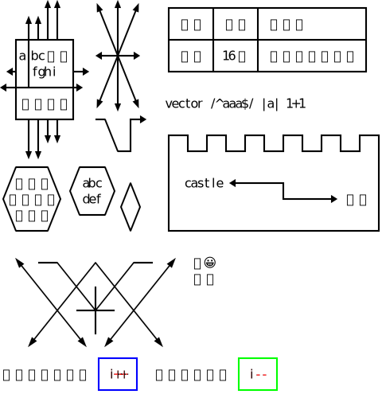
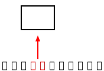

# Ascii Figure To Svg

アスキーアートで作図したテキストを、SVGファイルに変換します。

* version: 1.1.2
* Author: Masakazu Yanai
  * https://crocro.com/
  * https://twitter.com/ruten
* (c) 2020 Masakazu Yanai

[Demo : アスキーアートの図をSVGに変換](https://crocro.com/tools/item/ascii_figure_to_svg.html)

------------------------------------------------------------
## 特徴

全角文字を考慮しており、半角英数字、全角日本語が混在したテキストから、SVGへの変換を行います。

この手のライブラリにありがちな、以下の問題点を解決しています。

* 日本語の全角幅が考慮されていない。
	* → 考慮しています。
* 日本語の全角文字の上に縦線を引くと、左寄りか右寄りになり、全角幅にならない。
	* → 全角幅の縦線や矢印に対応。

一部の絵文字やサロゲートペアには対応していません。

第2引数に設定の一部を上書きするオブジェクトを書くことで、各種設定を変更して出力できます。

* 1マスの横幅や高さ。線の幅。
* 文字のサイズ、色、フォントの種類。
* 線の色。
* マージン。
* 最小横幅（全ての出力SVGの幅を統一したい時などに使用）。

------------------------------------------------------------
## サンプル

元の文字列。

```
       ^＾     ^  ^  ^    +------+------+----------------+
    ^＾|｜      \ | /     | 名前 | 年齢 | 出身地         |
  +-+＋+＋-+     \|/      +------+------+----------------+
  |a|bcＤＥ|   <--+-->    | 太郎 | 16歳 | 福岡県北九州市 |
 <+ |fghi  +->   /|\      +------+------+----------------+
<-+-+------+>   / | \     
  |あいうえ|   v  v  v    vector /^aaa$/ |a| 1+1
  +-+＋+＋-+   -+   +->   
    |｜vｖ       \  |     +--+  +--+  +--+  +--+  +--+  +--+
    vｖ           +-+     |  +--+  +--+  +--+  +--+  +--+  |
  +----+    +---+         |                                |
 /あいう\  / abc \  +     |  castle <-------+              |
+えおかき+ \ def / / \    |                 +-------> お城 |
 \くけこ/   +---+  \ /    |                                |
  +----+            +     +--------------------------------+
  
  ＾  --＋    ＋    ＋--  ＾  🔑😀
    ＼    ＼／  ＼／    ／    💻⭐
      ＼  ／＼｜／＼  ／    
        ＋  --＋--  ＋      
      ／  ＼  ｜  ／  ＼    
    ｖ      ｖ  ｖ      ｖ  
/*@({"y": [1, 1], "x": [17, 3], "isFig": false, "txtAttr": {"fill": "#f00"}})@*/
/*@({"y": [1, 1], "x": [39, 3], "isFig": false, "txtAttr": {"fill": "#f00"}})@*/
/*@({"y": [0, 3], "x": [15, 7], "figAttr": {"fill": "#00f", "stroke": "#00f"}})@*/
/*@({"y": [0, 3], "x": [37, 7], "figAttr": {"fill": "#0f0", "stroke": "#0f0"}})@*/
               +-----+               +-----+
インクリメント | i++ |  デクリメント | i-- |
               +-----+               +-----+
```

出力したSVG。



------------------------------------------------------------
## 作図に使える文字

### 半角記号

* 「+」結節点。あるいは折れ位置。
* 「-」横線。
* 「|」縦線。
* 「<」左矢印の三角形の部分。
* 「>」右矢印の三角形の部分。
* 「^」上矢印の三角形の部分。
* 「v」下矢印の三角形の部分。
* 「/」左下から右上への斜め線。
* 「\」左上から右下への斜め線。

### 全角記号

* 「＋」全角幅の結節点。あるいは折れ位置。
* 「｜」全角幅の縦線。
* 「＾」全角幅の上矢印の三角形の部分。
* 「ｖ」全角幅の下矢印の三角形の部分。
* 「／」全角幅の斜め線。
* 「＼」全角幅の斜め線。

### 変換のルール

作図に使える文字でも、作図部分ではないと判断された文字は、図形に変換されず、文字として扱われます。

------------------------------------------------------------
## 制御記法（1.0.5以降）

特定の位置の文字を、図形に変換したくない時もあります。そうした時は、制御記法を加えることで、特定の位置の文字を、図形化から外すことができます。

以下の行が入力文字に含まれている時、この領域は末尾の改行とともに削除されて、制御命令として解釈されます。この行を「制御行」と呼びます。制御行は、途中で改行を含んでも構いません。

```
/*@({"y": [要素0, 要素1], "x": [要素0, 要素1], "isFig": false})@*/
/*@({"y": [要素0, 要素1],
     "x": [要素0, 要素1],
     "isFig": false})@*/
```

制御行以降の、最初に通常の行を0行目として、yの"要素0"から、yの"要素1"行分、かつ、xの"要素0"文字目から、xの"要素1"文字分が、図形化の対象外になります。

|パラメータ|意味|
|:--|:--|
|y 要素0|開始行位置|
|y 要素1|行数（指定なしの場合は1）|
|x 要素0|開始文字位置|
|x 要素1|文字数（指定なしの場合は1）|

```
01234567890123456789
/*@({"y": [0, 1], "x": [9, 1], "isFig": false})@*/
---------+---------+
---------+---------+
/*@({"y": [0, 3],
     "x": [2, 3],
	 "isFig": false})@*/
/*@(
    {"y": [1], "x": [10], "isFig": false}
)@*/
---------+---------+
---------+---------+
---------+---------+
---------+---------+
```

出力したSVG。


応用として、文字や図形に色を付けたりすることも可能です。

```
    +------+
    |      |
    +------+
       ＾
       ｜
/*@({"y": [-2, 2], "x": [7, 2], "figAttr": {"fill": "#f00", "stroke": "#f00"}})@*/
/*@({"y": [0], "x": [6, 4], "txtAttr": {"fill": "#f00", "font-weight": "bold"}})@*/
ここに注目して下さい！
```



```
/*@({"y": [1, 1], "x": [18, 3], "isFig": false, "txtAttr": {"fill": "#f00"}})@*/
/*@({"y": [0, 3], "x": [16, 7], "figAttr": {"fill": "#00f", "stroke": "#00f"}})@*/
                +-----+ 
 インクリメント | i++ |
      ^         +-----+
      |
/*@({"y": [1, 1], "x": [18, 3], "isFig": false, "txtAttr": {"fill": "#f00"}})@*/
/*@({"y": [0, 3], "x": [16, 7], "figAttr": {"fill": "#0f0", "stroke": "#0f0"}})@*/
      v         +-----+ 
 デクリメント   | i-- |
                +-----+
```


------------------------------------------------------------
## プログラムでの利用

### Webでの利用方法

Webでの利用方法は、以下のとおりです。

```html
<script src="asciiFigureToSvg.js"></script>
<script>
    const af2s = asciiFigureToSvg;
    const txt = `<-- arrow -->`
    const svg = af2s.genSvg(txt).svg;
    console.log(svg);
</script>
```

### node.jsでの利用方法

node.jsでの利用方法は、以下のとおりです。

```js
const af2s = require('./asciiFigureToSvg.js');
const txt = `<-- arrow -->`
const svg = af2s.genSvg(txt).svg;
console.log(svg);
```

### 第2引数を指定

引数を指定することで、1マスのサイズや線幅、テキストや図のSVGの属性を変更できます。

```js
const opt = {prms: {unitW: 12, unitH: 24}};
const svg = af2s.genSvg(txt, opt).svg;
```

以下、パラメータとして指定可能な設定の全体像です。省略した場合は、デフォルトの値が使用されます。

```js
    {
        prms: {
            unitW: 8,       // 半角文字1マスの横幅
            unitH: 20,      // 文字1マスの高さ
            lineW: 2        // 線の太さ
            xMin: null      // X方向の最小値
        },
        txtAttr: {          // テキスト部分のSVGの属性
            'font-family': 'Meiryo, sans-serif',
            'font-weight': 'normal',
            'font-size':   '16px',
            'fill':        '#000',
            'dominant-baseline': 'central',
            'text-anchor': 'middle',
            cond: {         // 条件分岐で属性を設定
                han: {
                    'font-family': "MS Gothic, monospace",
                },
                zen: {
                }
            }
        },
        figAttr: {          // 作図部分のSVGの属性
            'fill':   '#000',
            'stroke': '#000',
            'stroke-width': '0.1px'
        },
        margin: {   // 出力全体のマージン
            top:    0,
            bottom: 0,
            left:   0,
            right:  0
        }
    }
```

### 戻り値

以下のプロパティを持つオブジェクトが、「genSvg()」の戻り値として得られます。

```js
	{
		svg: svgTxt,	// SVGのテキスト
		elArr: grp,		// SVGの各要素の配列
		xMax: xMax,		// 半角換算文字数の横幅最大値
		yMax: yMax,		// 行数
		svgW: svgW,		// SVGの横幅
		svgH: svgH,		// SVGの高さ
		opt: opt		// デフォルト値と合成した設定
	};
```

------------------------------------------------------------
## コマンドラインツールとして使用

### コマンドライン上で実行

Node.jsでコマンドラインツールにように使う場合は、問うプログラムのディレクトリで、以下のように使います。

```
node . "フルパス.aa.txt"
```

末尾が「.aa.txt」のUTF-8のテキストファイルを指定すると、末尾が「.svg」のSVGファイルを出力します。既に存在する場合は、上書きします。

```
node . "ディレクトリのパス"
```

ディレクトリのパスを指定した場合は、そのディレクトリ内の末尾が「.aa.txt」のファイルを元に、末尾が「.svg」のSVGファイルを出力します。既に存在する場合は、上書きしません（ファイル単体の場合と動作が違う）。

ver 1.1.2 から、第2引数にJSONのパスを書くと、その設定を反映して出力します。

```
node . "フルパス.aa.txt" "設定のJSONのパス"
node . "ディレクトリのパス" "設定のJSONのパス"
```

### Windowsのバッチファイルを利用

node.jsが実行できるWindows環境では、「index.bat」に末尾が「.aa.txt」のUTF-8のテキストファイルをドロップすると、ドロップしたファイルと同じディレクトリ内に、末尾が「.svg」のSVGファイルを出力します。SVGファイルが存在する場合は上書きします。

ディレクトリをドロップすると、そのディレクトリ内の末尾が「.aa.txt」のファイルを元に、末尾が「.svg」のSVGファイルを出力します。SVGファイルが存在する場合は、上書きしません（ファイル単体の場合と動作が違う）。
